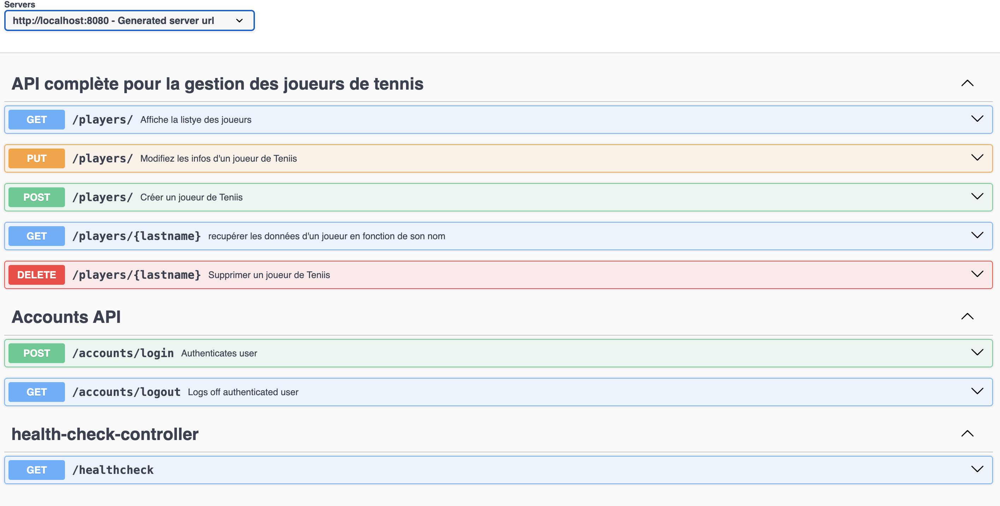

# 🎾 Tennis Management API - v1.0.0


Il s'agit d'une API professionnelle et complète dédiée à l'univers du tennis. Elle permet de gérer les acteurs du milieu (joueurs), les tournois, les inscriptions et offre un système de suivi des performances.

---
### Aperçu de l'interface Swagger

---

## 🚀 Fonctionnalités

* **Gestion des Joueurs (CRUD)** : Création, modification, suppression et affichage.
* **Authentification** : Système de login/logout pour sécuriser l'accès aux données gràce à Spring Security.
* **Classement Dynamique** : Gestion automatisée des points et des rangs.
* **Monitoring** : Point de terminaison `/healthcheck` pour vérifier l'état du serveur.
* **Documentation OpenAPI** : Intégration de Swagger UI.

## 🛠️ Stack Technique

* **Backend** : Java / Spring Boot / Spring Data JPA, Hibernate, Spring Security, PostgreSQL, Junit , Mockito 
* **Build Tool** : Maven
* **Containerisation** : Docker / Docker Compose / 
* **Documentation** : Swagger / OpenAPI 3.0

---

## 📖 Documentation des Endpoints

Une fois le serveur lancé, accédez à l'interface Swagger :  
👉 `http://localhost:8080/swagger-ui.html`

### Gestion des Joueurs
| Méthode | Endpoint | Description |
| :--- | :--- | :--- |
| `GET` | `/players/` | Affiche la liste des joueurs (Authentifié) |
| `POST` | `/players/` | Créer un nouveau joueur |
| `PUT` | `/players/` | Modifier les informations d'un joueur |
| `GET` | `/players/{lastname}` | Détails d'un joueur par son nom |
| `DELETE` | `/players/{lastname}` | Supprimer un joueur |

### Authentification & Système
| Méthode | Endpoint | Description |
| :--- | :--- | :--- |
| `POST` | `/accounts/login` | Authentification utilisateur |
| `GET` | `/accounts/logout` | Déconnexion |
| `GET` | `/healthcheck` | Vérifier la santé de l'API |

---

## 📦 Installation et Utilisation

### Via Maven
1. **Cloner le dépôt** :
   ```bash
   git clone [https://github.com/rayagnewende/Cr-ation-d-une-API-Compl-te-d-di-e-l-univers-du-Tennis-.git](https://github.com/rayagnewende/Cr-ation-d-une-API-Compl-te-d-di-e-l-univers-du-Tennis-.git)

## Compiler le projet :
./mvnw clean install

## Lancer le projet :
./mvnw spring-boot:run

## Via docker  :
* ** docker compose -f src/main/docker/prod/postgresql.yml up
* **  docker run --name dyma-tennis -p 8080:8080 --net prod_default \
-e SPRING_DATASOURCE_URL="jdbc:postgresql://dyma-postgres-production:5432/postgres" \
-e SPRING_DATASOURCE_USERNAME="postgres" \
-e SPRING_DATASOURCE_PASSWORD="5ML^Es#x%4U&DK6c" \
 dyma-tennis-api


##  Roadmap
* ** Implémentation du module Tournois.
* ** Ajout de la gestion des Inscriptions.
* ** Statistiques avancées (H2H - Face à Face).

## 👤 Auteur
Rayagnewende - Ingénieur Full Stack
